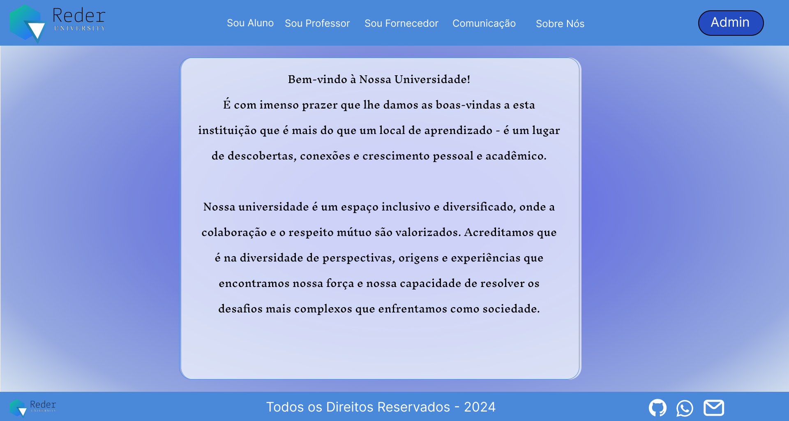
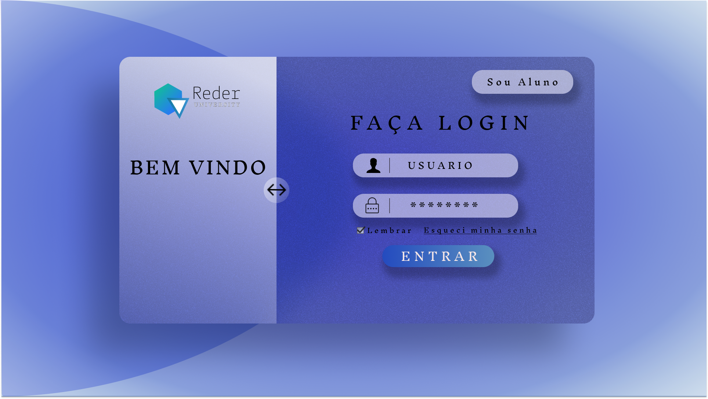
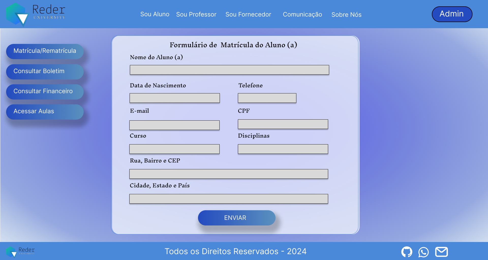
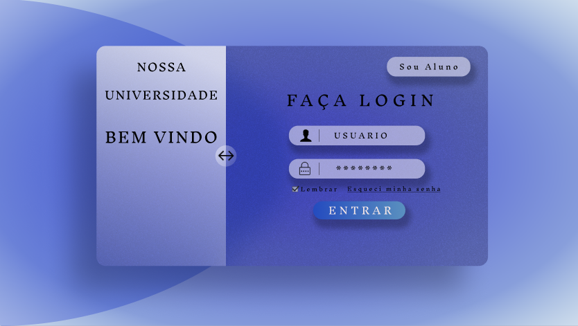
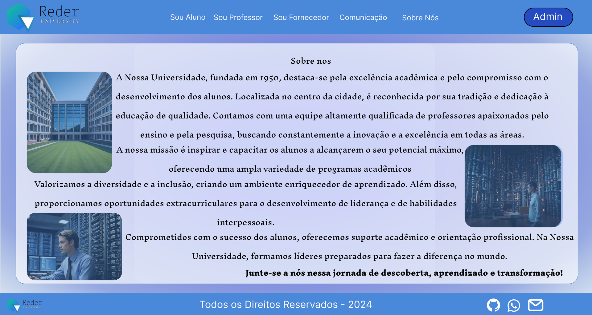

2# Apresentação do Projeto

---

## 👥 Integrantes do Grupo:

- Danilo Samuel dos Santos
- Erica de Araujo Macena
- Edgard Henrique da Silva
- Raphael Siqueira Dorta
- Renan Sergio de Paula

---

Este documento tem como objetivo apresentar os protótipos do nosso sistema para o gerenciamento de uma universidade.

### Objetivo do Sistema:

O sistema visa facilitar o gerenciamento de uma universidade, oferecendo funcionalidades para diferentes tipos de usuários, sejam eles pessoas físicas ou jurídicas.

### Tipos de Usuários:

| **Pessoas Físicas**  | **Pessoas Jurídicas** |
|:---------------------:|:-----------------------:|
| Alunos  👩‍🎓👨‍🎓 | Fornecedores  🏢 |
| Professores  👩‍🏫👨‍🏫 |                        |

---

# Interface da Página Inicial 🏠

Nesta seção, apresentaremos a interface da página inicial para os usuários.

---

| **💻 Interface da nossa Home page** |
|:-----------------------------:
|  | 

A página inicial de um site desempenha um papel crucial na experiência do usuário e no sucesso geral do site. Aqui estão algumas razões pelas quais a página inicial é importante:

**`Primeira Impressão:`** A página inicial é muitas vezes a primeira interação que os visitantes têm com o site. Uma página inicial bem projetada pode causar uma primeira impressão positiva, transmitindo profissionalismo, confiança e credibilidade.

**`Orientação do Visitante:`** A página inicial serve como um ponto de partida para os visitantes navegarem pelo site. Ela deve fornecer uma visão geral clara dos principais produtos, serviços ou informações oferecidos, ajudando os visitantes a entenderem rapidamente o propósito do site e a encontrar o que estão procurando.

**`Navegação Intuitiva:`** Uma página inicial bem organizada com um menu de navegação claro facilita a localização de informações e o acesso a diferentes partes do site. Isso melhora a experiência do usuário, reduz a frustração e aumenta a probabilidade de os visitantes explorarem mais páginas do site.

**`Conversão e Engajamento:`** A página inicial é frequentemente usada para direcionar os visitantes para ações específicas, como fazer uma compra, assinar um boletim informativo, entrar em contato ou explorar conteúdo adicional. Elementos como chamadas para ação (CTAs) estrategicamente colocadas podem aumentar as taxas de conversão e o envolvimento do usuário.

**`Branding e Identidade Visual:`** A página inicial é um espaço para destacar a identidade visual e a marca do site. Elementos visuais consistentes, como cores, fontes e imagens, ajudam a reforçar a marca e a criar uma conexão emocional com os visitantes.

**`SEO (Otimização para Motores de Busca):`** A página inicial é frequentemente a página mais importante em termos de otimização para mecanismos de busca. Ela deve conter palavras-chave relevantes, metadados otimizados e conteúdo de qualidade para melhorar a visibilidade nos resultados de pesquisa e atrair tráfego orgânico para o site.

Em resumo, a página inicial desempenha um papel fundamental na criação de uma experiência positiva para os visitantes do site, ajudando-os a encontrar o que precisam e incentivando a interação e conversão. Uma página inicial bem projetada e otimizada pode contribuir significativamente para o sucesso geral do site.

---

## 🎓 Opção Aluno

Nesta opção, os alunos terão acesso a uma variedade de operações:

### 1. Efetuar Login 🔐

| **💻 Interface da nossa Área do aluno** |
|:-----------------------------:
|  | 

O processo de efetuar login em um sistema online é uma etapa fundamental para que professores e alunos acessem os recursos disponíveis. Este guia detalha os passos envolvidos para alunos e possíveis cenários alternativos que podem surgir durante esse processo.

**`Acessar a Página de Login:`** O primeiro passo é acessar a página de login do sistema.

**`Inserir Credenciais de Acesso:`** É necessário inserir as credenciais de acesso corretas. Isso inclui um nome de usuário ou e-mail e uma senha previamente cadastrada.

**`Verificação das Credenciais:`** Após inserir as credenciais, o sistema verifica se elas correspondem às informações armazenadas no banco de dados. Se estiverem corretas, o acesso é concedido. Caso contrário, o sistema exibe uma mensagem  de acordo com possíveis cenários alternativos.

**`Cenários Alternativos:`** Se o usuário inserir credenciais inválidas, o sistema exibirá uma mensagem de erro informando que as credenciais são inválidas. Porém, o usuário pode tentar novamente.
Durante o processo de login, pode ocorrer um problema de conectividade com o servidor. Nesse caso, o sistema não consegue verificar as credenciais devido à falta de conexão com o servidor. Então, exibirá uma mensagem de erro indicando o problema de conectividade e o usuário deve tentar novamente quando a conexão for restabelecida.

Efetuar login é um procedimento simples e obrigatório. Seguindo os passos mencionados acima, estando ciente dos possíveis cenários alternativos, os usuários podem garantir um acesso seguro e eficaz da instituição.

---

### 2. Acessar Aulas 📚

| **💻 Interface para acesso as aulas** |
|:-----------------------------:
|  | 

A opção de acessar aulas online oferece aos alunos flexibilidade, permitindo o aprendizado de qualquer lugar e a construção de horários personalizados.

**`Autenticação no Sistema:`** Antes de acessar as aulas online, é necessário ter realizado o processo de login, assegurando que apenas alunos autorizados tenham acesso aos conteúdos acadêmicos.

**`Localização da Seção de Aulas:`** Selecione a opção acessar aulas no menu principal.

**`Seleção e Navegação entre as Aulas:`** Dentro da seção de aulas, os alunos encontram uma lista das matérias disponíveis. Ao escolher a disciplina desejada, é necessário selecionar uma aula específica para assistir. As aulas estão organizadas por disciplina e data de gravação.

**`Visualização do Conteúdo da Aula:`** Após selecionar uma aula, você será direcionado para a página onde o conteúdo da aula está disponível. Isso pode incluir vídeos gravados, apresentações de slides, documentos de leitura, ou qualquer outro material relacionado ao tópico abordado na aula. Os alunos podem assistir às aulas no momento em que prefererir.

**`Cenários Alternativos:`** Durante o acesso às aulas, os alunos podem encontrar alguns desafios, como aulas indisponíveis ou dificuldades de conectividade à internet. Nesses casos, é importante entrar em contato com o suporte técnico da instituição para resolver qualquer problema e garantir que o acesso ao conteúdo acadêmico não seja comprometido.

As aulas online não só são um pilar essencial na experiência educacional, mas também se apresentam como uma ferramenta indispensável, proporcionando a possibilidade de reassistir quantas vezes necessário.  Isso concede aos alunos maior controle sobre seu processo de aprendizado.

---

### 3. Consultar Boletim 📊

| **💻 Interface para consulta do boletim** |
|:-----------------------------:
|  | 

Consultar o boletim possibilita verificar a média final nas disciplinas, oferecendo uma análise abrangente do desempenho acadêmico.

**`Localização da Seção Consultar Boletim:`** Selecione a opção consultar o boletim no menu principal.

**`Visualização do Boletim:`** 
Ao selecionar a opção, o aluno é direcionado para uma nova tela onde pode especificar o curso e  período acadêmico desejado. Neste boletim, o aluno pode ver suas notas em cada disciplina, médias parciais e finais, assim como sua frequência nas aulas.

**`Cenários Alternativos:`**
No entanto, podem surgir cenários alternativos durante o processo de consulta do boletim. Por exemplo, pode não haver registros de notas para o período selecionado, o que indica a ausência de informações disponíveis para aquele semestre em particular. Nesse caso, o sistema geralmente exibe uma mensagem informativa indicando a falta de registros.
Além disso, problemas de conectividade podem surgir, impedindo o acesso do aluno ao sistema ou causando interrupções durante o processo de consulta. Isso pode ser frustrante para o aluno, que pode precisar tentar novamente mais tarde quando a conexão estiver mais estável.

---

### 4. Efetuar Matrícula/Rematrícula 📝

| **💻 Interface para efetuar matrícula e rematrícula** |
|:-----------------------------:
| | 

A matrícula é o ato inicial de inscrição em uma instituição educacional, enquanto a rematrícula é a renovação do vínculo para o próximo período letivo, assegurando a continuidade dos estudos. Ambos são processos cruciais para garantir a regularidade acadêmica.

**`Localização da Seção Efetuar Matrícula/Rematricula:`** Selecione a opção Efetuar Matrícula/Rematrícula no menu principal.

**`Escolha do Curso:`** Dentro do sistema de matrícula/rematrícula, os alunos têm a oportunidade de escolher o curso que desejam realizar a matricula. 

**`Confirmação das Disciplinas:`** No processo de Rematricula é necessário selecionar as disciplinas desejadas. Essa confirmação envolve revisar as disciplinas selecionadas e clicar em um botão de confirmação para finalizar o processo de matrícula/rematrícula.

**`Registro da Matrícula/Rematrícula:`** Uma vez confirmadas as escolhas, o sistema registra oficialmente a matrícula ou rematrícula. 

**`Cenários Alternativos:`** Em alguns casos, algumas das disciplinas selecionadas podem não estar disponíveis para matrícula, pré-requisitos não cumpridos ou outras razões. Nesse caso, o sistema informará ao aluno sobre a indisponibilidade das disciplinas selecionadas.

Durante o processo podem ocorrer problemas de conectividade com o sistema, impedindo que conclua o processo com sucesso. Isso pode ser causado por falhas na conexão com a internet ou problemas técnicos no sistema da instituição. Nesse caso, o aluno deve tentar novamente mais tarde ou entrar em contato com o suporte técnico para resolver o problema.

---

### 5. Consultar Finaceiro 💰

| **💻 Interface para consulta do financeiro** |
|:-----------------------------:
| | 

A consulta financeira desempenha um papel crucial na gestão das obrigações financeiras para com a instituição, garantindo que os alunos estejam plenamente cientes de suas mensalidades, taxas e demais despesas acadêmicas.

**`Localização da Seção Consultar Finaceiro:`** Selecione a opção Consultar Finaceiro no menu principal.

**`Visualização das Informações Financeiras:`** Após selecionar a opção de consulta financeira, o sistema exibe uma série de informações relevantes para o aluno. Isso pode incluir detalhes sobre mensalidades, taxas de matrícula, custos de material didático e outras despesas associadas à sua educação. Essas informações são apresentadas de forma clara e organizada para facilitar a compreensão do aluno.

**`Cenários Alternativos:`** Se não houver registros de informações financeiras, o sistema exibirá uma mensagem informando sobre essa situação. Isso pode ocorrer se o aluno não tiver pendências financeiras ou se os registros ainda não estiverem disponíveis.
Durante o processo de consulta pode haver um problema de conectividade com o servidor, impedindo o acesso das informações. Nesse caso, o sistema exibirá uma mensagem de erro indicando o problema e sugerindo que tente novamente mais tarde.

---

### 6. Consultar Desempenho 📊

| **💻 Interface para consultar o desempenho** |
|:-----------------------------:
| | 

Um componente crucial na jornada acadêmica de todo aluno é acompanhar de perto seu desempenho ao longo do curso. Isso envolve a verificação regular das notas em várias atividades das disciplinas.

**`Localização da Seção Consultar Desempenho:`** Selecione a opção Consultar Finaceiro no menu principal.

**`Escolher a Matéria:`** Dentro da seção consulta de desempenho, os alunos têm a opção de escolher a matéria específica para a qual desejam verificar seu desempenho. 

**`Visualização das Notas:`** Após selecionar a matéria desejada, o sistema exibe as notas obtidas pelo aluno em diferentes atividades avaliativas, como provas, trabalhos e participações.

**`Cenários Alternativos:`** Em alguns casos, pode haver pendências de informações, como notas que ainda não foram lançadas.. Nesses casos, o sistema informa ao aluno sobre essas pendências e orienta sobre como proceder.
Durante o processo de consulta, pode ocorrer um problema de conectividade com o servidor, o que pode impedir o acesso às informações acadêmicas. Nesses casos, os alunos devem verificar sua conexão com a internet e tentar novamente mais tarde.

A consulta de desempenho acadêmico é uma ferramenta valiosa para os alunos acompanharem seu progresso e identificarem áreas que precisam de melhoria. Ao seguir os passos descritos acima e estar ciente dos possíveis cenários alternativos, os alunos podem ter uma visão clara de seu desempenho acadêmico e tomar medidas para alcançar seus objetivos educacionais.

---
## Opção "Professor" 👨‍🏫

Nesta opção, os professores terão acesso a diversas operações:

### 1. Efetuar login

| **💻 Interface para Login do professor** |
|:-----------------------------:
|| 

**`Acesso à Plataforma Acadêmica:`** O processo de efetuar login em um sistema online é uma etapa fundamental para que professores e alunos acessem os recursos disponíveis. Este guia detalha os passos envolvidos para professores e possíveis cenários alternativos que podem surgir durante esse processo.

**`Acessar a Página de Login:`** O primeiro passo é acessar a página de login do sistema.

**`Inserir Credenciais de Acesso:`** É necessário inserir as credenciais de acesso corretas. Isso inclui um nome de usuário ou e-mail e uma senha previamente cadastrada.

**`Verificação das Credenciais:`** Após inserir as credenciais, o sistema verifica se elas correspondem às informações armazenadas no banco de dados. Se estiverem corretas, o acesso é concedido. Caso contrário, o sistema exibe uma mensagem de acordo com possíveis cenários alternativos.

**`Cenários Alternativos:`** Se o usuário inserir credenciais inválidas, o sistema exibirá uma mensagem de erro informando que as credenciais são inválidas. Porém, o usuário pode tentar novamente.
Durante o processo de login, pode ocorrer um problema de conectividade com o servidor. Nesse caso, o sistema não consegue verificar as credenciais devido à falta de conexão com o servidor. Então, exibirá uma mensagem de erro indicando o problema de conectividade e o usuário deve tentar novamente quando a conexão for restabelecida.

Efetuar login é um procedimento simples e obrigatório. Seguindo os passos mencionados acima, estando ciente dos possíveis cenários alternativos, os professores podem garantir um acesso seguro e eficaz da instituição

---

### 2. Lançamento de notas 📝

| **💻 Interface para efetuar o lançamento de notas** |
|:-----------------------------:
| | 

O lançamento de notas é vital no ciclo acadêmico, permitindo que os professores registrem o desempenho dos alunos. Sistemas acadêmicos online simplificam esse processo, oferecendo uma plataforma para inserção e gerenciamento das notas. Veja abaixo um guia detalhado sobre como os professores podem realizar essa tarefa de forma eficaz.

**`Localização da Seção Lançar Notas:`** Selecione a opção Lançar notas no menu principal.

**`Seleção da Disciplina:`** Escolha o curso e disciplina, a partir de uma lista disponível.

**`Exibição da Lista de Alunos:`** O sistema exibe uma lista dos alunos matriculados na disciplina selecionada.

**`Seleção do Aluno e Atividades Avaliativas:`** Escolha o aluno específico da lista e, em seguida, é apresentado uma lista das atividades avaliativas disponíveis para essa disciplina.

**`Inserção das Notas:`** Para cada atividade avaliativa, o professor insere as notas correspondentes ao desempenho do aluno. Isso pode incluir notas de provas, trabalhos, participações em sala de aula, entre outros.

**`Cálculo Automático da Média Final:`** Com base nas notas inseridas, o sistema calcula automaticamente a média final do aluno na disciplina. Isso simplifica o processo de avaliação e elimina a necessidade de cálculos manuais por parte do professor.

**`Revisão e Confirmação:`** O professor revisa cuidadosamente as notas calculadas pelo sistema. Se estiver satisfeito com os resultados, confirma o lançamento das notas, indicando que o processo está concluído.

**`Cenários Alternativos:`** Em casos onde erros são identificados ou se o professor opta por não lançar as notas, é possível reverter.
Se uma nota incorreta é inserida, o sistema permite a correção. Porém, se o professor decide não lançar as notas, o sistema mantém as informações anteriores e cancela o processo de lançamento.

---

### 3. Acessar aulas 📚

| **💻 Interface para acessar as aulas como professor** |
|:-----------------------------:
| | 

<!-- Texto explicativo sobre o processo de acessar aulas na visão do professor -->
A opção de disponibilizar aulas online oferece aos professores uma flexibilidade valiosa, permitindo-lhes ensinar de qualquer lugar e construir horários de aula personalizados.

**`Autenticação no Sistema:`** Antes que os professores possam acessar as aulas online, é necessário que tenham concluído o processo de login. Isso garante que apenas professores autorizados tenham acesso aos materiais educacionais.

**`Localização da Seção de Aulas`**: Instrua os professores a selecionar a opção 'acessar aulas' no menu principal do sistema.

**`Seleção e Navegação entre as Aulas:`** Dentro da seção de aulas, os professores encontrarão uma lista das matérias disponíveis. Eles devem escolher a disciplina desejada e selecionar uma aula específica para visualização. As aulas devem estar organizadas por disciplina e data de gravação para facilitar a navegação.

**`Visualização do Conteúdo da Aula:`** Após selecionar uma aula, os professores serão direcionados para a página onde o conteúdo da aula está disponível. Isso pode incluir vídeos gravados, apresentações de slides, documentos de leitura e outros materiais relacionados ao tópico abordado. Os professores devem ser encorajados a assistir às aulas no momento que melhor se adequar às suas necessidades de ensino.

**`Cenários Alternativos:`** Durante o acesso às aulas online, os professores podem encontrar desafios como aulas indisponíveis ou problemas de conectividade. Eles devem ser orientados a entrar em contato com o suporte técnico da instituição para resolver qualquer problema e garantir que o acesso ao conteúdo educacional não seja comprometido.

As aulas online são fundamentais para a experiência educacional, oferecendo aos professores a oportunidade de ensinar de forma mais flexível e eficiente.

---

## Opção "Fornecedor" 🛒

### 1. Gerenciar Fornecedor 🛍️

| **💻 Interface para gerenciar fornecedor** |
|:-----------------------------:
| |

O caso de uso "Gerenciar Fornecedor" é uma funcionalidade essencial em sistemas de gestão administrativa, permitindo que os administradores do sistema gerenciem eficientemente informações relacionadas aos fornecedores de uma instituição ou empresa. Este guia fornece uma visão geral dos passos envolvidos nesse processo:

**`Autenticação no Sistema:`** Antes de acessar a funcionalidade de gerenciamento de fornecedor, o administrador do sistema deve fazer login no sistema utilizando suas credenciais de acesso.

**`Acesso ao Painel de Administração:`** Após a autenticação bem-sucedida, o administrador é direcionado para o painel de administração, onde tem acesso a diversas ferramentas e funcionalidades para gerenciar aspectos administrativos da instituição.

**`Seleção da Opção "Gerenciar Fornecedor":`** Dentro do painel, selecione a opção específica de "Gerenciar Fornecedor" a partir do menu ou de uma lista de funcionalidades disponíveis.

**`Visualização da Lista de Fornecedores:`** O sistema exibe uma lista de fornecedores cadastrados, incluindo informações como nome, contato e detalhes do contrato. Essa lista permite uma visão geral dos fornecedores associados à instituição.

**`Seleção e Edição de Fornecedores:`** O administrador pode selecionar um fornecedor específico da lista para visualizar e editar detalhes como nome, contato e informações contratuais. Essa funcionalidade permite atualizar e manter precisas as informações relacionadas aos fornecedores.

**`Cenários Alternativos:`** Além da edição,  tem a opção de adicionar novos fornecedores, inserindo informações relevantes por meio de um formulário específico. Da mesma forma, é possível remover fornecedores não mais necessários, mantendo a lista atualizada e organizada. 

Para facilitar a localização de fornecedores específicos, o sistema oferece uma funcionalidade de pesquisa. O administrador pode inserir o nome ou outras informações relacionadas a um fornecedor na barra de pesquisa e obter resultados correspondentes.

Em resumo, o caso de uso "Gerenciar Fornecedor" proporciona aos administradores de sistemas uma maneira eficiente de gerenciar e manter atualizadas as informações relacionadas aos fornecedores de uma instituição. Ao seguir os passos descritos neste guia, os administradores podem garantir uma gestão eficaz dos recursos fornecidos pelos parceiros externos, contribuindo para o funcionamento adequado e eficiente da instituição.

---
## Opção "Sobre nós" 🤝

| **💻 Interface "Sobre nós** |
|:-----------------------------:
| | 

A guia "Sobre Nós" em um site desempenha um papel fundamental na construção da credibilidade, transparência e confiança entre a empresa e seus visitantes. Aqui estão algumas razões pelas quais o guia "Sobre Nós" é importante:

**`Contextualização da Empresa:`** A guia "Sobre Nós" fornece aos visitantes uma compreensão mais profunda da empresa, sua história, missão, visão e valores. Isso ajuda a contextualizar a empresa dentro do mercado e da indústria em que opera.

**`Conexão com o Público:`** Ao compartilhar informações sobre a equipe, cultura organizacional e história da empresa, a guia "Sobre Nós" cria uma conexão emocional com os visitantes. Isso pode levar a um aumento na identificação do público-alvo com a marca.

**`Construção de Confiança:`** Disponibilizar informações sobre a equipe de liderança, experiência e conquistas passadas ajuda a construir confiança com os visitantes. Eles se sentem mais seguros ao saber com quem estão fazendo negócios.

**`Demonstração de Credibilidade:`** A guia "Sobre Nós" é uma oportunidade para destacar prêmios, certificações, parcerias e outras conquistas da empresa. Isso ajuda a demonstrar sua credibilidade e experiência no setor.

**`Esclarecimento de Dúvidas:`** Muitas vezes, os visitantes têm dúvidas sobre a empresa, como sua história, valores ou equipe. A guia "Sobre Nós" é o lugar ideal para responder a essas perguntas de forma abrangente.

**`Diferenciação da Concorrência:`** A maneira como uma empresa se apresenta em sua página "Sobre Nós" pode diferenciá-la da concorrência. Destacar elementos únicos da empresa pode ajudar a atrair clientes em potencial.

Em resumo, a guia "Sobre Nós" desempenha um papel crucial na construção da reputação, confiança e identidade da empresa online. É uma oportunidade valiosa para comunicar a história, valores e conquistas da empresa aos visitantes do site.
